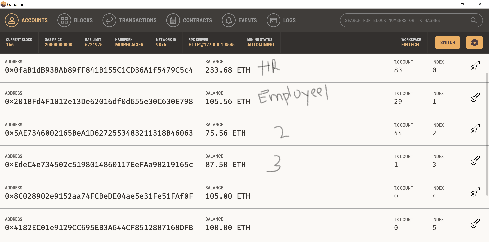
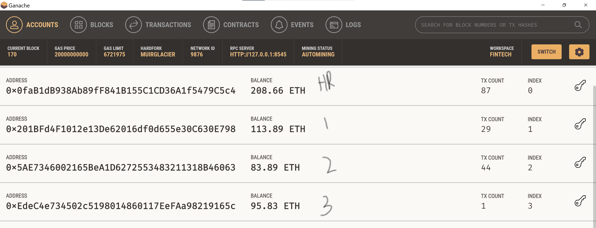

# Profit Splitter Smart Contracts

## Background

Your new startup has created its own Ethereum-compatible blockchain to help connect financial institutions, and the team wants to build smart contracts to automate some company finances to make everyone's lives easier, increase transparency, and to make accounting and auditing practically automatic!

The `ProfitSplitter` contracts will do several things:

* Pay your Associate-level employees quickly and easily.

* Distribute profits to different tiers of employees.

* Distribute company shares for employees in a "deferred equity incentive plan" automatically.

All the smart contracts will interact with a local ganache via Metamask. Ensure Remix is connected to ganache via Injected Web3`; the address/account selected in ganache will act as the HR.

### Level One: The `AssociateProfitSplitter` Contract
This contract accepts Ether into the contract and divides the Ether evenly among the associate-level employees. This will allow the Human Resources department to pay employees quickly and efficiently. For testing purposes, metamask is used to connect to an instance of ganache running on the local machine. HR, employee 1, employee two, and employee three are generated addresses using the same seed phrase by ganache. 

1. Open the AssociateProfitSplitter.sol file in Remix and compile and go to the deploy tab.
2. make a note of the address/account connected to metamask, as this will serve as the human resource account.
3. Go to the deploy tab and enter the address of employee 1, employee two, and employee3. For the testing purpose, we used the following from ganache
    - Employee 1 Address: 0x201BFd4F1012e13De62016df0d655e30C630E798
    - Employee 2 Address : 0x5AE7346002165BeA1D6272553483211318B46063
    - Employee 3 Address : 0xEdeC4e734502c5198014860117EeFAa98219165c

4. Click Deploy. This will deploy a smart contract on ganache. Metamask should pop up for confirmation showing the gas used to deploy. 
5. Optional: Click on balance. This should always return 0, as Ether is always sent to the beneficiaries. If it does not, the `deposit` function is not handling the remainders properly and should be fixed. This will serve as a test function of sorts. This can be done anytime, in this test was done once before calling deposit and once after.
7. In the value field, enter the amount to deposit in the associate employee's accounts; for testing purposes, we entered 25000000000000000000 wei (25 ETH).
6. Click on the deposit function button. This will again pop up Metamask, confirming the transaction, note the amount at the top.
7. Verify-in Ganache, the HR account should be the amount less, and the three employee accounts should have gained amount divided by 3. In our case, since we deposited 25 ETH, the HR account was deducted 25 ETH + gas used, and each employee account gained 8.333333333 ETH. The remainder (if any left) was sent back to the sender - HR, but it is such a small amount (in weight) that it does not show on ganache.

#### Kovan Testnet Contract Address 
Address : 0xaF741Baf28554ab4A9aF9E5Dd5cc8e524a7314cE
URL: https://kovan.etherscan.io/address/0xaF741Baf28554ab4A9aF9E5Dd5cc8e524a7314cE

### Level Two: The `TieredProfitSplitter` Contract

In this contract, rather than splitting the profits between Associate-level employees, rudimentary percentages are calculated for different tiers of employees (CEO, CTO, and Bob). Bob (employee 3) gets 15% of the amount, CTO (employee 2) gets 25% of the amount, and the CEO (employee 1) gets 60% plus any remaining left after it has been divided.

1. Open the TieredProfitSplitter.sol file in Remix and compile and go to the deploy tab.
2. Connect to MetaMask using Injected Web3` and ensuring MetaMask is pointed to `localhost:8545`, where ganache is running, if not already done so.
2. make a note of the address/account connected to metamask, as this will serve as the human resource account.
3. Go to the deploy tab and enter the address of employee 1, employee two and employee3. For the testing purpose, we used the following 

    - Employee 1 Address: 0x201BFd4F1012e13De62016df0d655e30C630E798
    - Employee 2 Address : 0x5AE7346002165BeA1D6272553483211318B46063
    - Employee 3 Address : 0xEdeC4e734502c5198014860117EeFAa98219165c
  
4. Click Deploy; this will create a smart contract. Metamask should pop up and needs confirmation to deploy the contract on ganache. 
5. Optional: Click on balance; this should always return 0, as Ether is always sent to the beneficiaries. If it does not, the `deposit` function is not handling the remainders properly and should be fixed. This will serve as a test function of sorts.
7. In the value field, enter the amount to deposit in the associate employee's accounts, for testing purposes, we entered 50000000000000000000 wei (50 ETH).
6. Click on the deposit function button; this will again pop up Metamask, confirming the transaction; note the amount at the top.
7. Verify-in Ganache, the HR account should be the amount less, and the three employee accounts should have gained amount according to the percentage assigned. 
In our case, since we deposited 50 ETH, the HR account was deducted 50 ETH + gas, and each Bob's account gained 7.5 ETH (15%), CTO's account gained 12.5 ETH (25%), and CEO's account gained 30 ETH (60%), there was no eth left over. If there were a remainder, it would be sent to the CEO, but such a small wei, that it does not show on ganache.

#### Kovan Testnet Contract Address 
Address : 0x52F10D65A80D3907b5425e455c1eB348a7c2F87b
URL: https://kovan.etherscan.io/address/0x52F10D65A80D3907b5425e455c1eB348a7c2F87b

### Level Three: The `DeferredEquityPlan` Contract

This contract will manage an employee's "deferred equity incentive plan," in which 1000 shares will be distributed over four years to the employee. It does not work with Ether but with amounts stored and set that represent the number of distributed shares the employee owns and enforcing the vetting periods automatically. In the first year, only 250 shares can be vested, hence distributed. In the second year, 250 more can be distributed, as now the vested shares are 500 in total, and so on until a total of 1000 shares, or four years. If the employee waits for 5+ years, he/she will still only be able to vest a max of 1000 shares.

### Test: To test the fake now, incrementing by 400 days each time.
1. Open the DeferredEquityPlan.sol file in Remix and compile and go to the deploy tab.
2. Connect to MetaMask using Injected Web3` and ensuring MetaMask is pointed to `localhost:8545`, where ganache is running, if not already done so.
2. make a note of the address/account connected to metamask, as this will serve as the human resource account.
3. Go to the deploy tab and enter the address of the employee 
 For the testing purpose, we used the following 
    - Employee  Address: 0x201BFd4F1012e13De62016df0d655e30C630E798
4. Click Deploy; this will create a smart contract. Metamask should pop up and needs confirmation to deploy the contract on the ganache. Go to the deployed contract to interact with it.
5. Click on distributed_shares; this should be 0 at the start, as no shares have been distributed yet.
6. Click on the distribute button, which will throw an error, as the shares have not vested yet, have to wait a year for it to vest.
7. Click on fastforward, and try steps 5 & 6 again, will be the same result, three more times, as we have to wait 365 days, and clicking fast forward four times, will get us to a value more than 365 (400)
8. Now go over steps 6 and then 5; step 6 will not give us an error now, and the transaction will go through, and on step 5, the shares now are 250 (the annual distribution we have setup)  

 Steps](./ScreenShots/DeferredEquityPlan1.gif)
9. Test: Shares can only be distributed if the contract is active: The contract can be deactivated anytime by clicking on deactivate, and click step 6 again, which should give an error: Contract not active.

### Test: Shares can only be distributed if the sender is HR or the employee
1. Open the DeferredEquityPlan.sol file in Remix and compile and go to the deploy tab.
2. Connect to MetaMask using Injected Web3` and ensuring MetaMask is pointed to `localhost:8545`, where ganache is running, if not already done so.
2. make a note of the address/account connected to metamask, as this will serve as the human resource account.
3. Go to the deploy tab and enter the address of the employee 
 For the testing purpose, we used the following 
    - Employee  Address: 0x201BFd4F1012e13De62016df0d655e30C630E798
4. Click Deploy; this will create a smart contract. Metamask should pop up and needs confirmation to deploy the contract on ganache. Go to the deployed contract to interact with it.
5. Switch to an account that is not the employee or HR in metamask; make sure it's reflected in the account.
6. Click on distribute or deactivate buttons
7. Should popup with Error: You are not authorized to execute this contract.
8. Switch to employee account and try steps 6 again; it should now not give the same error, might give a different error. 

### Test: After 5 years (500 fake nows), the max value of the distributed_shares does not exceed 1000.

#### Kovan Testnet Contract Address 
Address : 0x5Df75f45733FaD38c1C22e872c7990f62b29Babf
URL: https://kovan.etherscan.io/address/0x5Df75f45733FaD38c1C22e872c7990f62b29Babf

